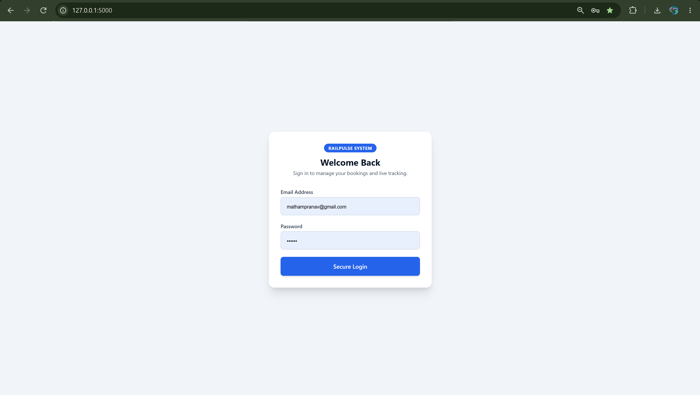
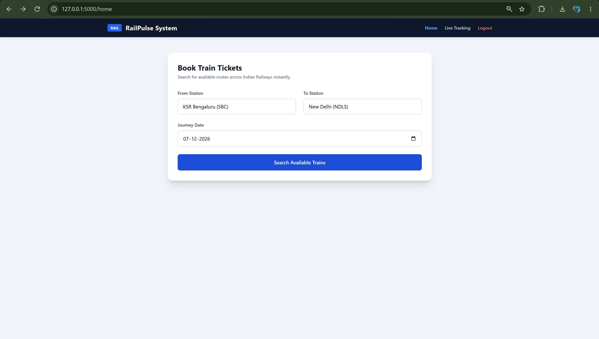
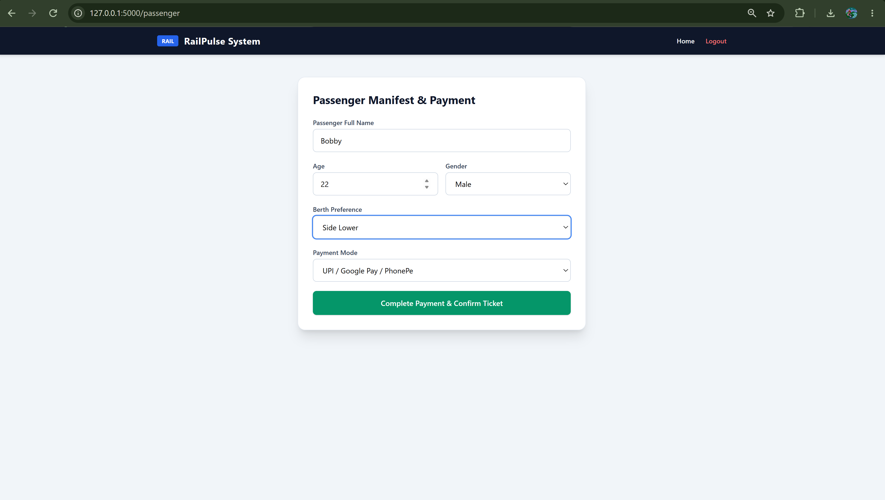
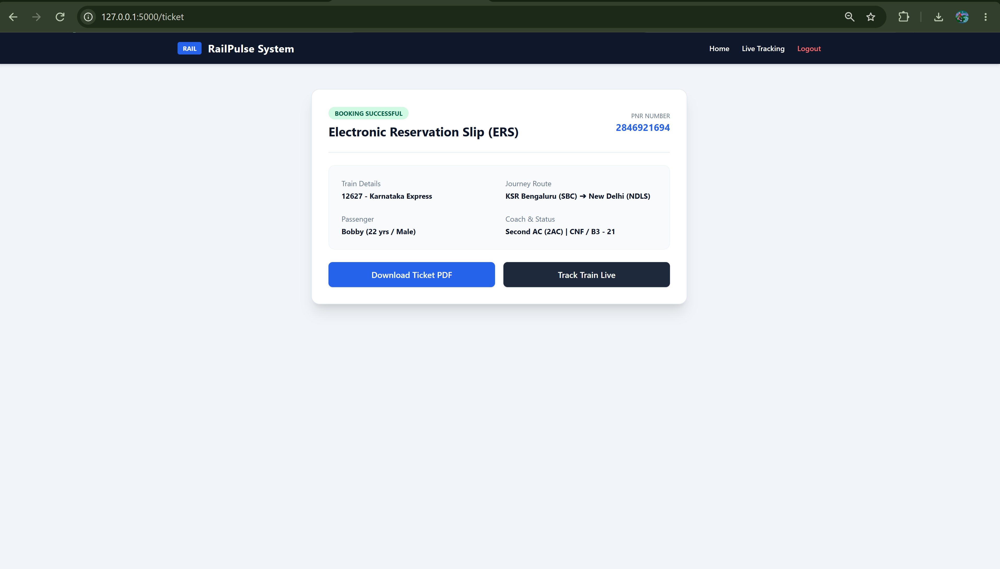
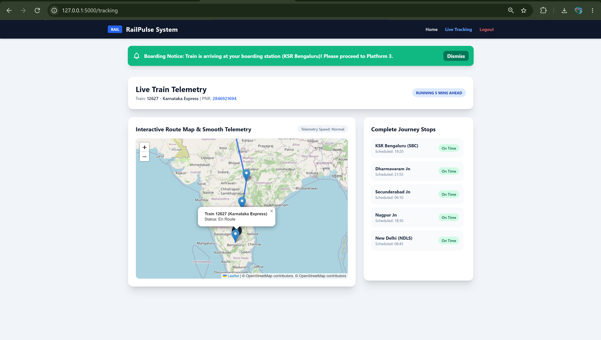

🚆 RailPulse – Live Train Telemetry & Reservation System

RailPulse is a modern, full-stack railway reservation and live tracking web platform built with Flask, Tailwind CSS, and Leaflet.js. It provides users with a seamless experience from booking tickets across multiple coach classes to tracking train locations in real-time with smooth GPS-like telemetry animations.

```
railway-reservation-system-main/
├── app.py
├── templates/
│   └── HTML templates
├── static/
│   ├── CSS
│   ├── JavaScript
│   └── images
├── login.png
├── train and coach.png
├── book.png
├── payment.png
├── ticket.png
└── track.png

```
🗄️ Core Components & Architecture
app.py — Flask Backend
| Component             | Description                                                         |
| :-------------------- | :------------------------------------------------------------------ |
| **Flask Application** | Handles the web application and request routing                     |
| **Train Search**      | Processes train search and journey selection                        |
| **Coach Selection**   | Supports multiple coach classes and class-based pricing             |
| **Passenger Details** | Collects passenger information required for booking                 |
| **Ticket Booking**    | Processes reservation details and generates the electronic ticket   |
| **Live Tracking**     | Provides train tracking and journey telemetry functionality         |
| **Journey Status**    | Handles train status and station-level journey information          |
| **Boarding Alerts**   | Triggers notifications as the train approaches the boarding station |

```
🎫 Reservation System
| Component             | Description                                        |
| :-------------------- | :------------------------------------------------- |
| **Train Search**      | Search available train schedules                   |
| **Coach Classes**     | Supports 1A, 2A, 3A, SL and CC                     |
| **Dynamic Pricing**   | Applies class-specific pricing multipliers         |
| **Passenger Details** | Captures passenger information for the reservation |
| **Ticket Generation** | Generates an Electronic Reservation Slip (ERS)     |
| **Payment Interface** | Provides the payment-stage booking interface       |

```
🗺️ Live Telemetry System

| Component               | Description                                                      |
| :---------------------- | :--------------------------------------------------------------- |
| **Interactive Map**     | Displays the train journey using Leaflet.js                      |
| **OpenStreetMap**       | Provides the underlying geographic map data                      |
| **Route Visualization** | Displays the complete geographic route                           |
| **Journey Stops**       | Displays stations along the train route                          |
| **Train Position**      | Represents the current simulated train location                  |
| **Smooth Animation**    | Uses `requestAnimationFrame` for continuous train movement       |
| **Status Updates**      | Displays `RUNNING ON TIME`, `DELAYED`, and `AHEAD` states        |
| **Boarding Alerts**     | Notifies the user when the train approaches the boarding station |

```
🧠 Telemetry & Animation Architecture
| Stage                    | Implementation                                  |
| :----------------------- | :---------------------------------------------- |
| **Route Data**           | Geographic coordinates representing the journey |
| **Route Rendering**      | Leaflet.js with OpenStreetMap                   |
| **Position Calculation** | Linear interpolation between route points       |
| **Animation Engine**     | `requestAnimationFrame`                         |
| **Train Movement**       | Smooth GPS-like movement along the route        |
| **Station Tracking**     | Journey stops mapped along the route            |
| **Status Matrix**        | Displays real-time journey status               |
| **User Alerts**          | Boarding notification based on train proximity  |


```
🔄 System Flow
1.User opens the RailPulse application.
2.User searches for a train and journey.
3.Available train information is displayed.
4.User selects a coach class.
5.Passenger details are entered.
6.Booking information is processed.
7.Payment interface is displayed.
8.Electronic Reservation Slip (ERS) is generated.
9.User can access live train tracking.
10.Interactive map displays the complete journey route.
11.Train moves smoothly along the route using telemetry animation.
12.Station arrival information and train status are displayed.
13.Boarding alerts are triggered when the train approaches the selected boarding station.
```
✨ Key Features
🎫 End-to-End Ticket Booking: Search train schedules, choose coach classes (1A, 2A, 3A, SL, CC) with dynamic pricing multipliers, input passenger details, and generate Electronic Reservation Slips (ERS).
🗺️ Interactive Live Telemetry Map: Powered by Leaflet.js and OpenStreetMap, displaying complete geographic route lines and journey stops.
🚆 Smooth Train Animation: Uses linear interpolation with requestAnimationFrame so the train moves smoothly along the route instead of jumping between locations.
📍 Journey Stops & Status Matrix: Displays station arrival information with dynamic status badges such as RUNNING ON TIME, DELAYED, and AHEAD.
🚨 Automated Boarding Alerts: Displays dynamic notifications when the train approaches or reaches the user's boarding station.
🎨 Modern UI/UX: Built using Tailwind CSS with responsive layouts, glassmorphism/card styling, micro-transitions, and interactive form states.

```
🚀 Tech Stack
| Category                    | Technologies / Tools                   |
| :-------------------------- | :------------------------------------- |
| **Backend**                 | Python, Flask                          |
| **Templating**              | Jinja2                                 |
| **Frontend**                | HTML5, Tailwind CSS, JavaScript ES6+   |
| **Maps**                    | Leaflet.js                             |
| **Map Data**                | OpenStreetMap                          |
| **Animation**               | `requestAnimationFrame`                |
| **Routing & Interactivity** | Linear interpolation, DOM manipulation |
| **Layout**                  | Responsive Flexbox / CSS Grid          |


```
⚙️ Setup & Local Development
1. Clone the Repository
   git clone https://github.com/PRANAV-MS25/railway-reservation-system.git
cd railway-reservation-system

2. Install Flask
pip install flask

3. Run the Application
python app.py

4. Open in Browser
Open:
http://127.0.0.1:5000
```
📸 Application Preview
1. Authentication & Train Search
|  Login & Authentication  |      Train Search & Coach Selection      |
| :----------------------: | :--------------------------------------: |
|  |  |
2. Booking & Payment
| Booking & Passenger Details | Payment Gateway Interface |
| :-------------------------: | :-----------------------: |
|         |    |
3. Ticket & Live Tracking
|    Generated Electronic Ticket   | Live Map Telemetry & Tracking |
| :------------------------------: | :---------------------------: |
|  |    |
```
🎯 Project Highlights
| Area                | Implementation                                |
| :------------------ | :-------------------------------------------- |
| **Reservation**     | End-to-end railway ticket booking workflow    |
| **Coach Selection** | Multiple coach classes with dynamic pricing   |
| **ERS**             | Electronic Reservation Slip generation        |
| **Live Tracking**   | Interactive Leaflet-based train tracking      |
| **Telemetry**       | Smooth GPS-like train movement                |
| **Route Mapping**   | Complete route and journey-stop visualization |
| **Train Status**    | Dynamic running status indicators             |
| **Alerts**          | Automated boarding notifications              |
| **UI/UX**           | Responsive Tailwind CSS interface             |
```
🌐 Repository

GitHub Repository: PRANAV-MS25/railway-reservation-system

👨‍💻 Author

M Pranav

GitHub: @PRANAV-MS25

© 2026 Pranav Matham. All rights reserved.

